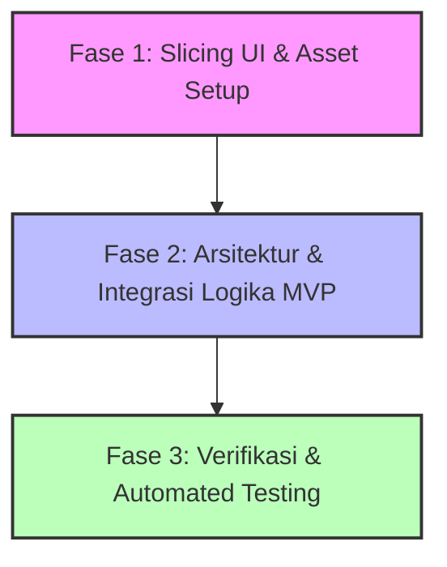

# Roadmap Pengembangan TemanCrita MVP

Dokumen ini mendefinisikan peta jalan (roadmap) pengembangan aplikasi **TemanCrita** dengan fokus awal pada **Slicing UI** (tampilan berkualitas tinggi sesuai referensi desain), diikuti oleh **Integrasi Logika MVP (Supabase, Gemini, Midtrans)**, dan diakhiri dengan **Pengujian (Testing & Verification)**.

---

## 📌 Ringkasan Fase Pengembangan



1. **Fase 1: Slicing UI (Fokus Utama Sekarang)**
   * Menerjemahkan visual dari gambar referensi (`docs/Design References/`) dan panduan komponen JSONC (`splash.jsonc`, `onboarding.jsonc`, `login.jsonc`, `register.jsonc`) menjadi kode widget Flutter yang presisi dan responsif menggunakan Material 3 dan token warna yang tepat.
2. **Fase 2: Integrasi Logika MVP**
   * Mengatur arsitektur berbasis fitur (*feature-first*) dan memisahkan `lib/main.dart` menjadi modul-modul terpisah.
   * Menghubungkan Supabase Auth, database PostgreSQL, integrasi Google Gemini API, dan sistem pembayaran Midtrans menggunakan Supabase Edge Functions.
3. **Fase 3: Verifikasi & Testing**
   * Menyelesaikan isu runtime lokal, menulis unit test untuk aturan state, widget test untuk komponen UI, dan integration test untuk seluruh alur transaksi.

---

## 🔄 Alur Kerja Kolaborasi Slicing UI

Untuk setiap halaman pada Fase Slicing UI, kita menggunakan alur kerja berikut:
1. **Penyusunan Spesifikasi JSONC:** Anda akan melengkapi berkas `.jsonc` untuk suatu halaman di direktori `docs/Design References/` (yang memuat spesifikasi properti, jarak/padding, layout, teks literal, dan nama aset).
2. **Pengecekan Visual:** Saya akan meninjau berkas gambar `.png` pada direktori terkait untuk memahami estetika visual, skema gradien, maskot, serta keselarasan warna.
3. **Eksekusi Slicing:** Saya akan merelasikan instruksi dari `.jsonc` dan visual dari `.png` tersebut untuk melakukan coding UI Flutter yang pixel-perfect.

---

## 🛠️ Checklist Detail Eksekusi

### 🎨 Fase 1: Slicing UI (Pixel-Perfect)
Fase ini berfokus pada visual, tata letak, mikro-animasi, dan aset gambar/vektor tanpa logika backend aktif (menggunakan *state placeholder* / *mock data*).

#### 1. Setup & Desain Sistem Dasar
- [x] Buat dan konfigurasi font **Plus Jakarta Sans** menggunakan `google_fonts`.
- [x] Siapkan aset dasar (PNG untuk mascot & awan hiasan) ke dalam folder `assets/`.
- [x] Sinkronisasikan token warna di `app_colors.dart` agar mendukung warna baru dari desain:
  * `primaryIndigo` (`#4338CA`)
  * `primaryLavenderText` (`#9F9DFE` / HSL Lavender)
  * `backgroundSoftWhite` (`#FFFFFF`)
  * `backgroundLavender` (`#EEF2FF`)
  * `textNavy` (`#1A1A2E`)
  * `textBlueGrey` (`#6B7280`)

#### 2. Slicing Halaman Utama & Auth
- [x] **Splash & Loading Screen** (`splash.jsonc`):
  * Latar belakang gradien linear vertikal & layer hiasan awan bawah.
  * Logo TemanCrita (228x228) + slogan *"Karena Kamu Gak Sendirian"*.
  * Mascot awan (342x300) dengan bayangan halus.
  * `CircularProgressIndicator` kustom ukuran 70x70 dengan teks *"Menyiapkan ruang amanmu..."*.
- [x] **Onboarding Intro Screen** (`onboarding.jsonc`):
  * Tombol "Lewati" berbentuk kapsul (*pill*) transparan di kanan atas.
  * Hiasan bintang putih/lavender/kuning tersebar di latar belakang Stack.
  * Mascot awan besar (640x430) di tengah.
  * Teks judul besar & deskripsi.
  * Tiga baris fitur terperinci (Pahami diri, Dukungan selalu ada, Terhubung dengan psikolog) lengkap dengan ikon MingCute/Iconsax & pemisah garis tipis.
  * Tombol utama gradien *"Mulai Sekarang"* & tombol sekunder *"Masuk"*.
  * Indikator halaman (3 titik navigasi).
- [x] **Login Screen** (`login.jsonc`):
  * Mascot brand header awan di bagian atas (650x520).
  * Form input Email & Password dengan ikon dalam box input, bayangan tipis, dan *focused border* warna Indigo.
  * Tombol *"Lupa Password?"* rata kanan.
  * Tombol utama *"Masuk"* dengan dekorasi gradien dan bayangan.
  * Pembatas horizontal *"atau masuk dengan"* diapit garis halus.
  * Tombol *"Masuk dengan Google"* (ikon Google + teks) di bagian bawah.
  * Link navigasi bawah: *"Belum punya akun? Daftar di sini"*.
- [x] **Register Screen** (`register.jsonc`):
  * Mascot awan bersinar (430x288) di atas judul *"Buat Akunmu"*.
  * Input Email & Password dengan pesan instruksi minimal 8 karakter.
  * Baris persetujuan (*consent check*) berupa kotak persetujuan & teks RichText dengan tautan *"Syarat & Ketentuan"* dan *"Kebijakan Privasi"* berwarna biru/indigo.
  * Tombol utama *"Daftar"* gradien.
  * Opsi masuk dengan Google & tautan *"Sudah punya akun? Masuk di sini"*.

#### 3. Slicing Halaman Dashboard & Fitur Inti
- [x] **Dashboard Screen (Home Tab):**
  * Header personal dengan foto profil user/inisial nama & tombol notifikasi.
  * Bento Row: Reflection card (desain kartu rapi dengan kutipan motivatif) dan Upcoming Session card (dengan penanda tanggal aktif).
  * Mood Graph Card: Bar chart 7 hari yang interaktif untuk memetakan emosi mingguan.
  * Quick Actions Row: Kumpulan aksi cepat (tarik napas, jurnal, cerita AI, tidur) yang dapat di-scroll horizontal.
  * Streak Card: Banner informasi streak 7 hari dengan latar belakang teal primer.
- [x] **AI Matching Screen (Curhat AI Tab):**
  * Tampilan Input Curhatan: Kolom teks besar (minimal 5 baris) & pilihan kategori tag emosi (cemas, kerja, tidur, dll. dengan batas maksimal 3 pilihan).
  * Halaman Animasi Pencarian (Scanning): Transisi memukau saat AI menganalisis cerita selama 3 detik sebelum menampilkan hasil.
  * Halaman Hasil Matching: Kartu rekomendasi 3 psikolog dengan bio, spesialisasi, rating, bahasa, harga, dan alasan personal kecocokan dari AI.
- [x] **Marketplace & Detail Psikolog (Eksplor Tab):**
  * Halaman daftar psikolog dengan bar pencarian dan opsi filter kategori masalah.
  * Profil detail psikolog: foto profesional, deskripsi bio klinis, rating bintang, ketersediaan jadwal slot, serta opsi aksi *"Coba Chat 10 Menit"* atau *"Booking Sesi Penuh"*.
- [ ] **Trial Chat Room:**
  * Area obrolan pesan dengan gelembung chat kontras (user di kanan, psikolog di kiri).
  * Header obrolan yang menampilkan sisa waktu uji coba secara real-time dengan status dinamis (Hijau → Jingga saat waktu kritis).
  * Dialog kedaluwarsa (Expired Dialog) yang muncul otomatis saat waktu habis dengan tawaran konversi *"Booking Sekarang"* atau *"Nanti Saja"*.
- [ ] **Booking & Payment Checkout:**
  * Ringkasan detail pemesanan psikolog, pilihan jadwal, dan opsi pembelian paket bundel (3 sesi diskon 20%).
  * Pilihan metode pembayaran (QRIS, GoPay, Virtual Account) dengan status pilihan yang jelas.
  * Halaman pembayaran sukses (Payment Success) dengan nomor ID transaksi, status konfirmasi hijau, dan tombol kembali ke halaman beranda.

---

### ⚙️ Fase 2: Integrasi Logika MVP
Fase ini berfokus pada refactoring arsitektur proyek dan menghidupkan seluruh tombol, input, database, AI, dan sistem transaksi.

#### 1. Arsitektur Proyek & Refactoring
- [ ] Terapkan **Feature-First Architecture** dengan memisahkan `lib/main.dart` menjadi folder fitur:
  ```
  lib/
  ├── core/               # Konfigurasi global (theme, routing, network, models)
  └── features/           # Modul fitur terisolasi
      ├── auth/           # Login, Register, User State
      ├── dashboard/      # Main Home, Streak, Mood Graph
      ├── ai_matching/    # Gemini API, scanning, recommendations
      ├── marketplace/    # Explore, Psychologist Detail, Chat Trial
      └── booking/        # Selection, Payment Gate, Success Screen
  ```
- [ ] Ganti manajemen status bawaan dengan **Riverpod** (`flutter_riverpod`) dan routing terpusat memakai **GoRouter** (`go_router`) lengkap dengan *auth redirection guard*.

#### 2. Integrasi Backend (Supabase)
- [ ] Setup Supabase Flutter client di dalam aplikasi.
- [ ] Hubungkan **Supabase Auth** untuk proses Sign In & Sign Up (mendukung autentikasi email & Google Sign-In).
- [ ] Hubungkan **Supabase Database** untuk membaca data master psikolog real-time.
- [ ] Implementasikan CRUD untuk pencatatan mood harian (`mood_logs`) dan pembacaan riwayatnya ke grafik dashboard.
- [ ] Simpan data booking konsultasi (`consultations`) ke database dengan status *pending* saat checkout dimulai.

#### 3. Integrasi AI (Google Gemini 1.5 Flash)
- [ ] Hubungkan input curhatan pengguna ke API **Google Gemini 1.5 Flash** via client SDK.
- [ ] Atur prompt klinis yang menghasilkan keluaran format JSON untuk menyaring alasan rekomendasi, menyarankan kata sifat emosi pengguna, dan merekomendasikan psikolog yang cocok berdasarkan keahlian mereka.

#### 4. Integrasi Payment Gateway (Midtrans)
- [ ] Setup endpoint pembayaran aman melalui **Supabase Edge Functions** agar Midtrans Server Key tidak bocor di sisi client.
- [ ] Kirim data pemesanan lokal ke Edge Function → kembalikan token pembayaran Midtrans Snap → buka halaman pembayaran lokal.
- [ ] Setup webhook dari Midtrans ke database Supabase untuk mengubah status transaksi dari *pending* menjadi *confirmed* secara otomatis setelah pembayaran sukses.

---

### 🧪 Fase 3: Verifikasi & Automated Testing
Fase ini memastikan kualitas kode, performa, dan keandalan sistem sebelum produk didistribusikan ke pengguna.

#### 1. Penyelesaian Isu Lingkungan Kerja
- [ ] Selesaikan isu crash Dart VM (`runtime/vm/cpuinfo_macos.cc`) agar perintah pengujian lokal dapat dijalankan dengan lancar.

#### 2. Unit Testing (Logika Bisnis)
- [ ] Tulis unit test untuk aturan validasi input curhatan (tidak boleh kosong, maksimal 3 tag kategori).
- [ ] Tulis unit test untuk perhitungan sisa waktu obrolan trial dan transisi status peringatan waktu kritis.
- [ ] Tulis unit test untuk logika harga bundel (diskon 20% untuk 3 sesi).

#### 3. Widget & UI Testing
- [ ] Tulis widget test untuk memverifikasi kesesuaian render elemen visual pada halaman Splash, Onboarding, Login, dan Register.
- [ ] Tulis widget test untuk memastikan perubahan warna indikator waktu di Chat Trial berubah warna saat waktu kritis.

#### 4. Integration Testing (E2E)
- [ ] Tulis E2E integration test menggunakan `integration_test` untuk mensimulasikan alur pengguna penuh:
  * *Onboarding → Login → Tulis Curhatan → Hasil AI Matching → Detail Psikolog → Trial Chat (Tunggu Expired) → Booking Sesi → Bayar via QRIS (Simulasi Sukses) → Dashboard utama memperlihatkan status sesi terkonfirmasi.*
- [ ] Jalankan analisis kode statis (`flutter analyze`) untuk memastikan tidak ada error maupun warning yang tersisa.

---

## 📈 Rencana Garis Waktu (Timeline)

| Hari / Minggu | Target Utama | Keluaran (Deliverable) |
|---|---|---|
| **Minggu 1: Hari 1-3** | Slicing Awal Aplikasi | Splash, Onboarding, Login, & Register screens selesai sesuai detail JSONC. |
| **Minggu 1: Hari 4-7** | Slicing Dashboard & Eksplor | Dasbor Bento, grafik mood, halaman daftar & profil psikolog. |
| **Minggu 2: Hari 8-10** | Slicing Chat Trial & Booking | Ruang obrolan trial (timer), checkout pembayaran, dan halaman sukses. |
| **Minggu 2: Hari 11-14** | Arsitektur & Supabase | Pembagian folder fitur, integrasi login & database dasar Supabase. |
| **Minggu 3: Hari 15-18** | Integrasi Gemini & Midtrans | Sistem pencocokan AI real-time, Supabase Edge Functions, dan transaksi Midtrans Snap. |
| **Minggu 3: Hari 19-21** | Testing & Polishing | Unit & integration test sukses, perbaikan bug VM, dan QA final. |
